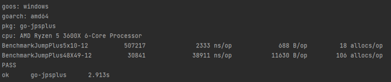

## Jump Point Search Plus 的 Golang 实现

JpsPlus 会对地图进行预处理，所以只适用于静态地图

### BenchMark
两张地图，都是阻挡较复杂，对角计算路径。


### 使用
```
import "github.com/shameby/jpsplus"

var origin = [][]uint8 // your map

var jpsMatrix = go-jpsplus.
```

### 参考：

1.博客：https://www.cnblogs.com/KillerAery/p/12242445.html

2.算法原论文：http://grastien.net/ban/articles/hg-aaai11.pdf